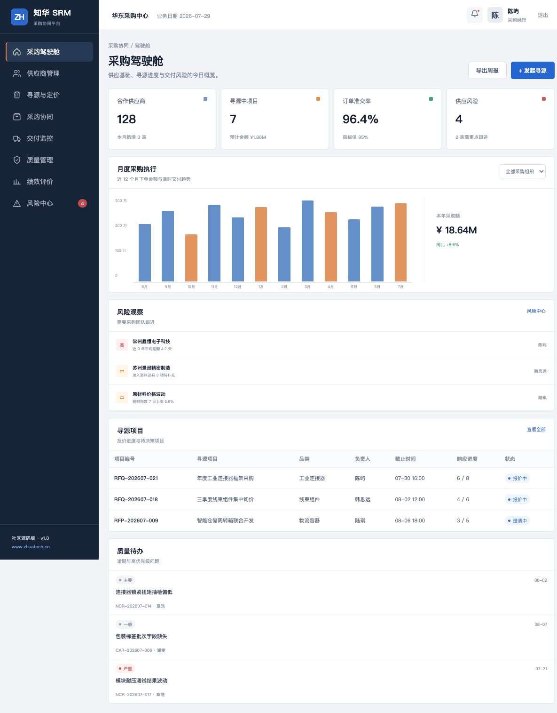
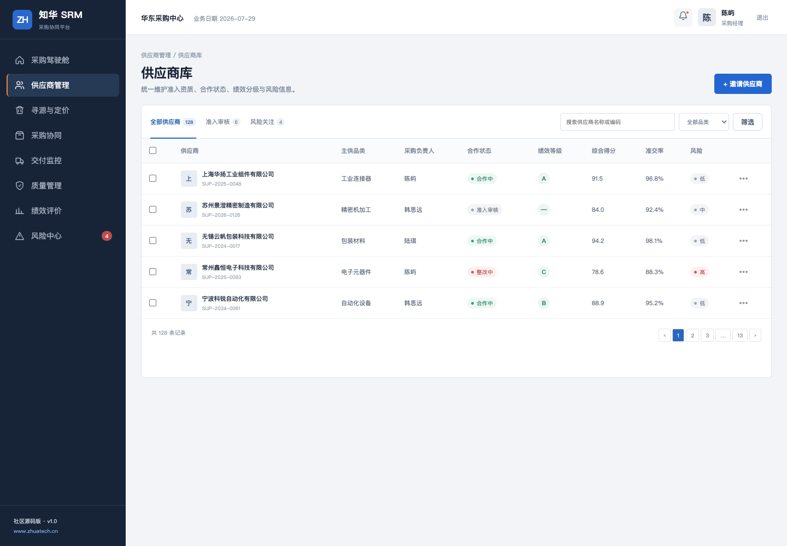
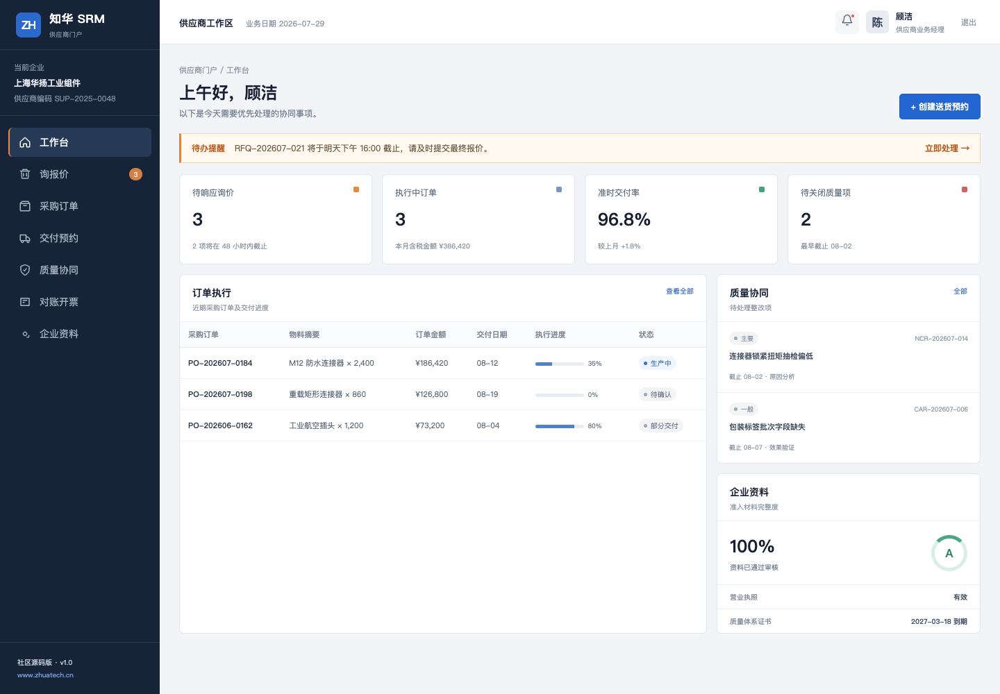
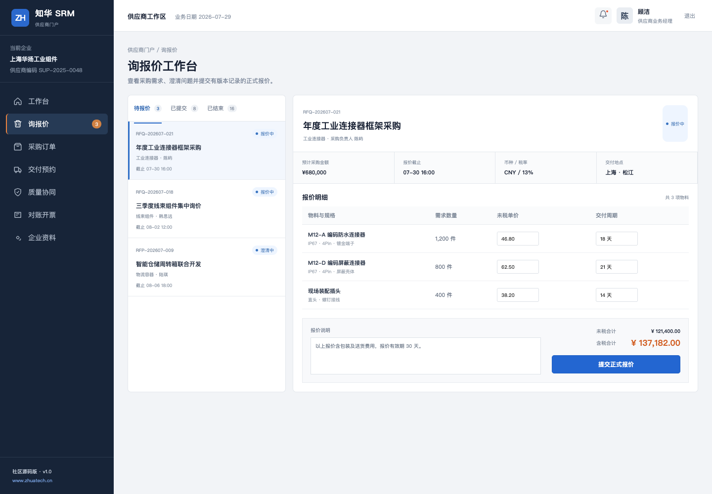

# ZhuaTech SRM

> 把供应商协同从邮件、群聊和分散表格，收回到一条可追踪的业务链上。

[](backend/pom.xml)
[](backend/pom.xml)
[](frontend/package.json)
[](compose.yaml)
[](LICENSE)

ZhuaTech SRM 是由 **知华科技（上海如静知华信息科技有限公司）** 发布的供应商关系管理系统社区源码版。工程采用前后端分离架构，覆盖供应商准入、寻源询报价、采购订单、送货协同、质量整改、对账开票、绩效评价与供应风险等常见业务。

- 官方网站：[https://www.zhuatech.cn/](https://www.zhuatech.cn/)
- Java 工程包名：`cn.zhuatech.srm`
- 适用场景：个人学习、供应链数字化研究、前后端工程实践
- 深度定制、生产部署及商业授权：请联系知华科技

## 这套系统解决什么

SRM 的价值不只是“建一个供应商档案库”。它需要让采购方和供应商围绕同一份业务事实协作：

```text
准入资料 → 寻源询价 → 定标下单 → 交付预约 → 质量闭环 → 对账评价
   ↑                                                       ↓
   └──────────────── 绩效分级与风险复评 ────────────────────┘
```

本社区版将这条链路拆成两个工作空间：

| 工作空间 | 面向角色 | 核心任务 |
| --- | --- | --- |
| 供应商门户 | 供应商业务、质量、财务人员 | 补充资质、报价、确认订单、预约交付、提交整改、核对账单 |
| 采购管理端 | 采购、SQE、供应链负责人、审计人员 | 管理供应商、组织寻源、监控交付、处理质量问题、评价绩效与风险 |

## 页面实览

下面的图片由本仓库前端演示模式真实运行后截取，不是概念图。

### 采购驾驶舱



把合作供应商、寻源金额、订单准交率和供应风险放在同一页；下方同时呈现年度采购执行、风险观察和正在推进的寻源项目，适合采购负责人每日巡检。

### 供应商库



供应商不是一张静态通讯录。列表同时显示主供品类、采购负责人、合作状态、绩效等级、准交率和风险等级，并预留准入审核与风险关注视图。

### 供应商工作台



供应商登录后只看到与自身企业相关的待办、订单、质量整改及企业资质状态，减少跨企业数据暴露和沟通噪音。

### 在线询报价



询价要求、物料规格、单价、交期和报价说明集中录入。后端保留正式报价接口，便于继续扩展报价版本、附件、澄清与审批记录。

## 功能版图

| 业务域 | 已包含的社区版能力 | 可继续扩展 |
| --- | --- | --- |
| 供应商准入 | 企业资料、联系人、资质进度、合作状态 | 问卷模板、电子签章、工商数据核验 |
| 寻源管理 | RFQ/RFP 列表、邀请与响应统计、在线报价 | 多轮竞价、评分模型、定标审批 |
| 采购协同 | 订单查询、订单确认、执行进度 | 订单变更、排产反馈、合同关联 |
| 交付协同 | 送货入口与交付状态页面 | ASN、预约时段、条码与收货差异 |
| 质量协同 | NCR/CAR 问题、严重度、整改状态 | 8D、附件、抽检、PPAP |
| 对账结算 | 对账与开票页面骨架 | 三单匹配、税务接口、付款计划 |
| 绩效风险 | 评分、准交率、风险等级和驾驶舱 | 指标权重、自动预警、供应连续性模型 |
| 权限与审计 | JWT、采购/供应商/管理员/审计角色 | 数据权限、审批流、操作审计报表 |

## 技术结构

```text
zhuatech-srm/
├── backend/                     # Java 21 + Spring Boot 后端
│   └── src/main/java/cn/zhuatech/srm
├── frontend/                    # Vue 3 + Vite 响应式 H5 前端
├── docs/                        # 架构、接口、数据模型与页面截图
├── deploy/                      # 部署说明
├── compose.yaml                 # MySQL、后端、前端一键编排
├── LICENSE                      # 个人非商业社区源码许可
└── NOTICE                       # 权属与第三方声明
```

后端采用 Controller → Service → Repository 分层，MySQL 表统一使用 `srm_` 前缀，数据库结构由 Flyway 管理。前端在一套 Vue 工程内提供两类导航和数据视图，通过角色决定进入供应商门户或采购管理端。

更多设计说明见 [系统架构](docs/architecture.md)、[接口说明](docs/api.md) 和 [数据模型](docs/database.md)。

## 五分钟启动

### Docker Compose（推荐）

准备 Docker 24+ 与 Compose v2：

```bash
cp .env.example .env
docker compose up --build
```

浏览器访问 `http://localhost:8090`。

### 本地开发

后端需要 JDK 21、Maven 3.9 和 MySQL 8：

```bash
cd backend
mvn spring-boot:run
```

前端需要 Node.js 20+：

```bash
cd frontend
npm install
npm run dev
```

如果只想体验界面，可运行 `npm run dev:demo`，无需启动后端和数据库。

## 演示账号

| 工作区 | 账号 | 密码 | 角色 |
| --- | --- | --- | --- |
| 供应商门户 | `supplier` | `Demo@2026` | 供应商用户 |
| 采购管理端 | `buyer` | `Demo@2026` | 采购经理 |
| 采购管理端 | `auditor` | `Demo@2026` | 审计只读角色 |
| 系统管理 | `admin` | `ZhuaTech@2026` | 管理员 |

以上仅为本地初始化演示账号。部署前必须删除示例数据、修改密码和 JWT 密钥，并按实际组织配置权限。

## 配置与安全

所有环境变量示例位于 `.env.example`，仓库不包含生产密钥。建议至少完成以下工作后再考虑内部验证：

1. 使用随机强密码替换 MySQL、管理员和 JWT 演示配置；
2. 通过 HTTPS、网关限流和可信 CORS 来源保护接口；
3. 对供应商隔离、字段权限和导出权限进行二次安全评审；
4. 接入企业身份源、审计日志、备份恢复与漏洞扫描；
5. 不要把社区版演示数据和默认账号带入生产环境。

## 许可边界

**本工程仅可用于个人、非商业性的学习、研究和技术交流，不得商用。** 企业内部生产使用、SaaS、私有化交付、收费服务、投标、商业培训及其他直接或间接商业用途，均须事先取得 **上海如静知华信息科技有限公司** 的书面授权。

由于带有非商业限制，本项目准确性质为“社区源码版 / source-available”，不属于 OSI 定义的开源软件。完整条款以 [LICENSE](LICENSE) 为准。

## 深度开发与商业授权

如果需要多组织、多工厂、采购审批流、ERP/WMS/QMS 集成、电子签章、供应商风险模型、国产化适配或生产级部署，可联系知华科技评估。

| 微信咨询一 | 微信咨询二 |
| --- | --- |
|  |  |

也可以通过 [知华科技官网](https://www.zhuatech.cn/) 了解上海如静知华信息科技有限公司的软件项目外包、企业信息化、FDE 与企业 AI 落地服务。

## 参与项目

提交 Issue 或 Pull Request 前请阅读 [贡献指南](CONTRIBUTING.md) 与 [行为准则](CODE_OF_CONDUCT.md)。安全问题请按照 [SECURITY.md](SECURITY.md) 中的方式私下报告，不要在公开 Issue 中披露漏洞细节。

---

Copyright © 2026 上海如静知华信息科技有限公司。保留所有权利。

## 供应商风险画像

新增 `POST /api/admin/supplier-risk`，将质量得分、准时交付率、逾期天数、未关闭质量问题和单一来源属性合并为风险分与处置等级。高风险结果会给出质量改善、交付恢复和第二来源寻源动作，帮助采购团队把绩效评价转成可执行任务。
